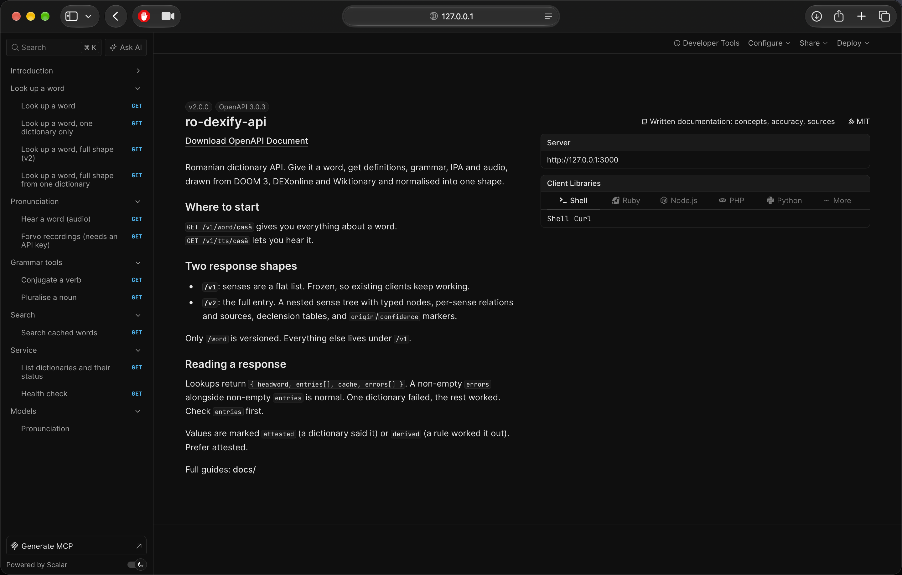
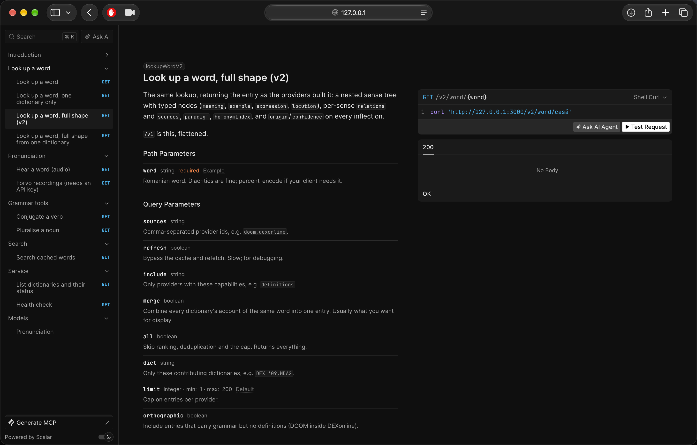
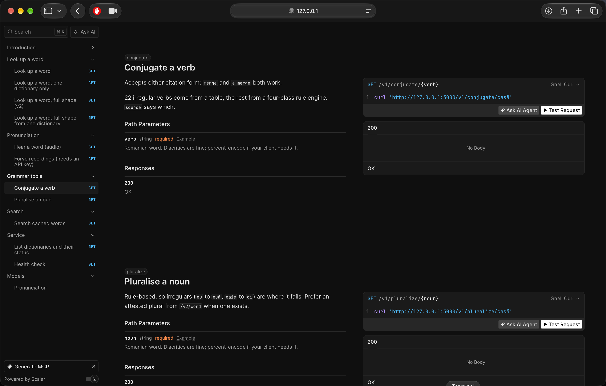
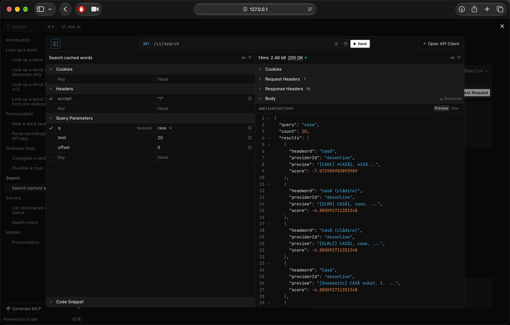

# ro-dexify-api

Romanian dictionary data, normalized behind one typed HTTP API.

Give it a word and get definitions, grammar, inflections, etymology, IPA, syllabification, stress,
and pronunciation audio assembled from DOOM 3, DEXonline, Romanian Wiktionary, and local language
tools. The service is written in TypeScript, runs on Node.js and SQLite, and ships with an
interactive OpenAPI reference.

> Version 2.0.0 · Node.js 20+ · MIT codebase · non-commercial data usage

## What it does

- Aggregates several Romanian dictionaries into one stable response shape.
- Preserves source attribution and authority instead of hiding provenance.
- Distinguishes dictionary-attested data from rule-derived data.
- Exposes both a frozen flat `/v1` format and a richer recursive `/v2` format.
- Provides full-text search, conjugation, pluralization, IPA, and audio.
- Keeps working when one upstream fails through timeouts, circuit breakers, and partial responses.
- Runs locally with SQLite—no MySQL, MariaDB, or privileged setup required.

Every parser is tested against recorded responses from the real upstream sites. A nightly live check
detects markup or API changes before they quietly corrupt results.

## See it in action

Start the service and open **[http://localhost:3000/docs](http://localhost:3000/docs)**. Scalar lists
every operation, request parameter, response, and client snippet in one interactive reference.



The main `/v2/word` operation exposes the complete nested entry model, including typed senses,
relations, sources, paradigms, and confidence markers.



Grammar helpers are documented alongside dictionary operations. Conjugation covers common
irregular verbs plus a four-class rule engine; pluralization is computed locally.



### Real searches from the Scalar sandbox

These are successful requests executed from Scalar's **Test Request** panel against a locally seeded
database—not mocked output. Each screenshot shows the submitted query, `200 OK`, result count, and
returned JSON.

| Search for `casa` | Search for `copil` |
|---|---|
| [](docs/screenshots/scalar-search-casa-response.png) | [](docs/screenshots/scalar-search-copil-response.png) |

Search is diacritic-folded, so `casa` also finds `casă`. Results come from the local FTS5 index and
do not need an upstream request.

## Quickstart

```bash
pnpm install
pnpm bootstrap --lite
pnpm dev
```

Then visit:

- Interactive API reference: <http://localhost:3000/docs>
- OpenAPI document: <http://localhost:3000/openapi.json>
- Health check: <http://localhost:3000/v1/healthz>

`pnpm bootstrap --lite` creates the SQLite database and imports a representative subset of the GPL
DEX dump. The upstream archive is streamed and filtered locally, then removed. Use
`pnpm bootstrap --no-seed` for migrations only; live lookups populate the cache on demand.

### First requests

```bash
# Definitions, grammar, IPA, and inflections
curl 'http://localhost:3000/v1/word/cas%C4%83?merge'

# Full recursive sense tree
curl 'http://localhost:3000/v2/word/cas%C4%83?merge'

# Diacritic-folded local search
curl 'http://localhost:3000/v1/search?q=casa&limit=10'

# Grammar and audio metadata
curl 'http://localhost:3000/v1/conjugate/merge'
curl 'http://localhost:3000/v1/pluralize/cas%C4%83'
curl 'http://localhost:3000/v1/tts/cas%C4%83?meta'
```

## API map

| Method | Endpoint | Purpose |
|---|---|---|
| `GET` | `/v1/word/:word` | Aggregate lookup with flat senses |
| `GET` | `/v1/word/:word/:source` | Flat lookup from one provider |
| `GET` | `/v2/word/:word` | Full recursive entry |
| `GET` | `/v2/word/:word/:source` | Full entry from one provider |
| `GET` | `/v1/search?q=` | FTS5 search over cached entries |
| `GET` | `/v1/tts/:word` | Human or synthesized pronunciation |
| `GET` | `/v1/audio/:word` | Forvo passthrough when configured |
| `GET` | `/v1/conjugate/:verb` | Romanian verb forms |
| `GET` | `/v1/pluralize/:noun` | Romanian noun plural |
| `GET` | `/v1/sources` | Provider and circuit-breaker status |
| `GET` | `/v1/healthz` | Service and database health |
| `GET` | `/openapi.json` | OpenAPI 3.0 document |
| `GET` | `/docs` | Interactive Scalar reference |

## Response versions

Only word lookup is versioned.

- `/v1` is frozen for existing clients. Senses are returned as a flat list.
- `/v2` returns the provider-native entry: a recursive sense tree with typed nodes (`meaning`,
  `sub-meaning`, `example`, `expression`, and `locution`), per-sense relations and sources,
  paradigms, homonym indexes, and origin/confidence metadata.

The server builds `/v2` first and produces `/v1` through a flattening adapter.

### Lookup controls

| Parameter | Effect |
|---|---|
| `?sources=doom,dexonline` | Restrict lookup to named providers |
| `?refresh` | Bypass cached upstream data |
| `?all` | Skip ranking, deduplication, and the default cap |
| `?dict=DEX '09,MDA2` | Restrict contributing dictionaries |
| `?limit=N` | Cap entries per provider; default `8` |
| `?orthographic` | Include entries carrying grammar but no definition |
| `?merge` | Combine providers describing the same lexical entry |
| `?include=definitions` | Require a provider capability |

Filtering and ranking happen after cache reads. A filtered request therefore cannot poison later
unfiltered results.

## Example word entry

`GET /v1/word/casă?sources=doom`

```json
{
  "id": "3616fe0c09939afac183e85967",
  "headword": "casă",
  "displayHeadword": "casă",
  "partOfSpeech": "substantiv",
  "inflections": [
    { "form": "casei", "tags": ["genitive", "dative", "articulated"] },
    { "form": "case", "tags": ["plural"] }
  ],
  "pronunciations": [
    { "ipa": "/ˈka.sə/", "syllabification": "ca-să", "stressMark": "cásă" }
  ],
  "senses": []
}
```

Empty DOOM senses are intentional: DOOM is an orthographic dictionary. Definitions come from
DEXonline and Wiktionary. With `?merge`, the API combines their complementary data while retaining
the contributor list.

## Data sources

| Provider | Supplies | Default |
|---|---|---|
| `doom` | Orthography, stress, syllabification, inflections, verb paradigms | On |
| `dexonline` | Definitions, sense trees, etymology, relations, examples, declensions | On |
| `wiktionary` | Definitions, etymology, IPA, declension and conjugation templates | On |
| `conjugare` | 22 irregular verb tables plus a four-class rule engine | On, local |
| `pluralro` | Rule-based pluralization | On, local |
| `mdex` | A secondary rendering of the DEX corpus | Opt-in with `?sources=mdex` |
| `forvo` | Recorded pronunciations | Requires `FORVO_API_KEY` |
| `dlr` | Academic definitions | Unavailable; upstream has no fetchable word pages |

DEXonline uses two documents on a cache miss: its JSON API for definitions and, after the site's
two-second crawl delay, the rendered page for relations, examples, and declension tables. If the
second request fails, the JSON result is still returned.

## Search

`GET /v1/search?q=&limit=&offset=` searches the local SQLite FTS5 index.

- Romanian diacritics are folded: `casa` matches `casă`.
- Every term is treated as a prefix.
- Results include the headword, provider, preview, and relevance score.
- FTS operators such as `AND`, `OR`, `NEAR`, `:`, and `^` are quoted and searched as text.

Search covers seeded data plus entries cached by earlier live lookups.

## Pronunciation and audio

`GET /v1/tts/:word` returns audio bytes. Add `?meta` for JSON containing the engine, MIME type, byte
count, licence, attribution, IPA, syllabification, and stress origin.

Audio uses three tiers:

1. A human recording from Wikimedia Commons, including the Lingua Libre Romanian corpus.
2. Optional Piper neural TTS (`ro_RO-mihai-medium`) for `?voice=male` when `PIPER_BIN` and
   `PIPER_MODEL` point to usable files.
3. espeak-ng through WebAssembly, always available as the fallback.

The default synthesized voice is female. Use `?voice=male`, force the fallback with
`?engine=espeak`, or override the espeak variant through `TTS_VOICE`. Audio is cached by word and
voice under `.cache/tts/`. Licence and attribution also travel in percent-encoded `X-Audio-*`
headers.

## Accuracy and provenance

The API says whether a value was read from a source or computed:

- `inflections[].origin` is `attested` or `derived`.
- `inflections[].confidence` is `high` or `low`.
- `pronunciations[].stressOrigin` records whether stress was attested.
- `source.authority` scores the contributing dictionary from 0 to 100.
- On merged entries, attested forms beat derived duplicates.

A derived transcription never overwrites an attested one. DEXonline paradigms are parsed as full
HTML grids, preserving case, number, article, tense, person, and other grammatical tags.

## Reliability and safety

- Per-provider circuit breaker: five consecutive failures open it for 60 seconds.
- Per-host token-bucket limits, including published upstream crawl delays.
- Eight-second provider timeout and twelve-second total lookup budget.
- `Promise.allSettled` fan-out, so one provider cannot erase successful results from others.
- ETag and Last-Modified replay for upstream documents.
- Sanitized HTML output and Zod input validation.
- FTS queries are safely quoted instead of interpreted as operators.
- Optional API-key enforcement and global request rate limiting.

A response may contain both non-empty `entries` and non-empty `errors`. That means one source failed
while others succeeded; clients should inspect `entries` first.

## Configuration

Copy `.env.example` or set environment variables directly:

```dotenv
PORT=3000
HOST=0.0.0.0
DB_PATH=./vocabulary.db
USER_AGENT="ro-dexify-api/2.0 (+https://github.com/k6w/ro-dexify-api; non-commercial)"
REQUEST_TIMEOUT_MS=8000
TOTAL_BUDGET_MS=12000
RATE_LIMIT_PER_MIN=60
ENABLE_DLR=false
FORVO_API_KEY=
FORVO_DAILY_QUOTA=500
TTS_VOICE=
PIPER_BIN=
PIPER_MODEL=
DEX_DUMP_URL=https://dexonline.ro/static/download/dex-database.sql.gz
REQUIRE_API_KEY=false
```

## Development

```bash
pnpm dev                # development server with hot reload
pnpm build              # compile into dist and copy runtime assets
pnpm start              # run the compiled build
pnpm bootstrap --lite   # migrations and representative seed
pnpm bootstrap --no-seed
pnpm seed               # re-seed without reinstalling dependencies
pnpm test               # Vitest suite
pnpm test:ci            # tests plus suite-execution guard
pnpm typecheck          # TypeScript without emitting files
pnpm lint               # Biome checks
pnpm check:live         # run parsers against current upstream pages
pnpm fixtures:refresh   # re-record live fixtures
pnpm voices             # download the optional Piper Romanian voice
```

## Documentation

| Need | Read |
|---|---|
| Install and make the first request | [Getting started](docs/getting-started.md) |
| Understand common vocabulary | [Concepts](docs/concepts.md) |
| Browse all endpoints | [API overview](docs/api/README.md) |
| Configure word lookup | [Word lookup](docs/api/word-lookup.md) |
| Choose `/v1` or `/v2` | [API versions](docs/api/versions.md) |
| Use audio and voices | [Pronunciation](docs/api/pronunciation.md) |
| Read every response field | [Entry schema](docs/data/entry-schema.md) |
| Decide what data to trust | [Accuracy](docs/data/accuracy.md) |
| Understand ranking and merge | [Ranking](docs/data/ranking.md) |
| Review every dictionary | [Sources](docs/sources/README.md) |
| Understand IPA and stress | [Phonetics](docs/phonetics/README.md) |
| Operate the service | [Configuration](docs/operations/configuration.md) · [Deployment](docs/operations/deployment.md) · [Troubleshooting](docs/operations/troubleshooting.md) |
| Contribute code | [Architecture](docs/contributing/architecture.md) · [Testing](docs/contributing/testing.md) · [Add a provider](docs/contributing/adding-a-provider.md) |

## Licensing and attribution

- **DOOM 3:** CC BY-NC-SA 4.0, non-commercial only; Institutul de Lingvistică „Iorgu Iordan –
  Al. Rosetti”.
- **DEXonline:** GPL data. The seed dump is downloaded during setup and is not committed.
- **Romanian Wiktionary:** CC BY-SA 4.0.
- **Wikimedia Commons audio:** licence varies per file and is returned with the response.
- **espeak-ng:** GPL-3.0; synthesized audio is offered as CC0.
- **Piper `ro_RO-mihai-medium`:** MIT when the optional tier is installed.
- **Forvo:** proprietary, with per-clip speaker credit.

Provider attribution is included in `entry.source.attribution`; recording attribution is included in
the TTS response and headers.

The project code is MIT-licensed. Because DOOM data is CC BY-NC-SA, deployments using that provider
must remain non-commercial and preserve attribution.
